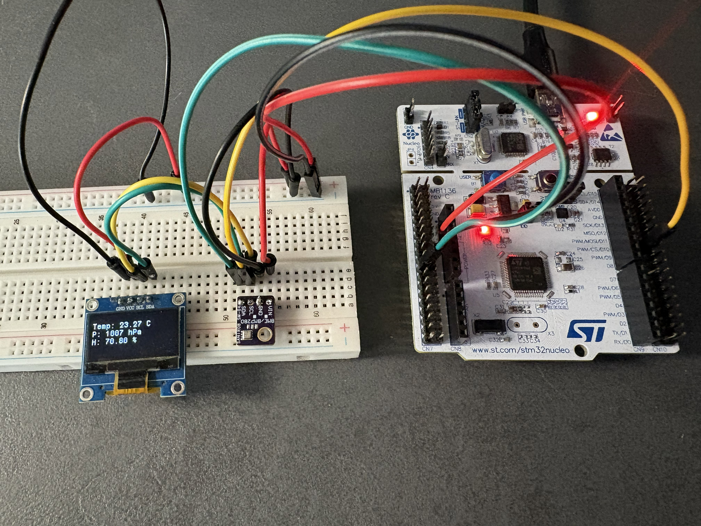
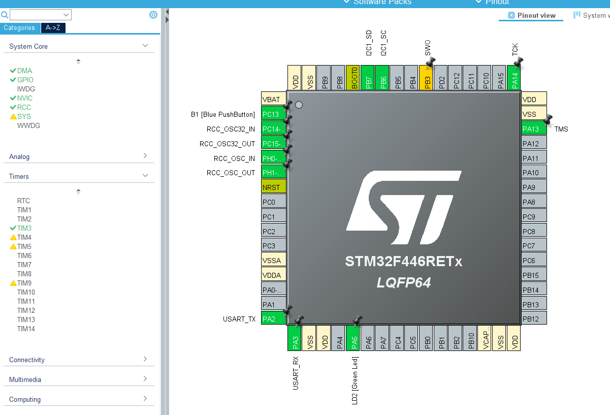
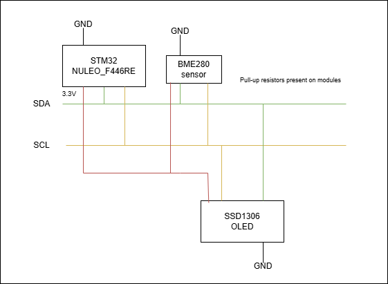

# STM32 Weather Station

STM32-based weather station using BME280 sensor and I2C OLED display.

## Demo

### Hardware setup

### Temperature reaction (sensor heating)

## Planned Features
- [x] UART communication for debugging
- [x] Temperature measurement
- [x] Humidity measurement
- [x] Pressure measurement
- [x] OLED display (I2C)

## Future Ideas
- Integrate FreeRTOS for task-based system architecture

## Overview
This project reads temperature, humidity, and pressure data from the BME280 sensor and displays it on an SSD1306 OLED screen via I2C. UART is used for debugging output.
The project is designed as a learning exercise for STM32 development and embedded systems.

## Getting Started

### Requirements
- STM32CubeIDE
- STM32 NUCLEO-F446RE
- BME280 sensor
- SSD1306 OLED display

### Setup
1. Clone the repository
2. Open project in STM32CubeIDE
3. Build and flash to the board
4. Connect sensors according to schematic

## Tools

* STM32CubeIDE
* STM32CubeMX
* SSD1306 OLED driver
* C language

## Hardware
* STM32 NUCLEO-F446RE
* BME280 Sensor
* SSD1306 OLED display (128x64)

### STM32CubeMX configuration

## Schematic

## Author
- Nikodem Wyborny

## Licenses

This project is licensed under the MIT License.

This project includes a custom BME280 driver implemented based on the Bosch datasheet and reference algorithms.

This project uses stm32-ssd1306 library:

Copyright (c) 2018 Aleksander Alekseev